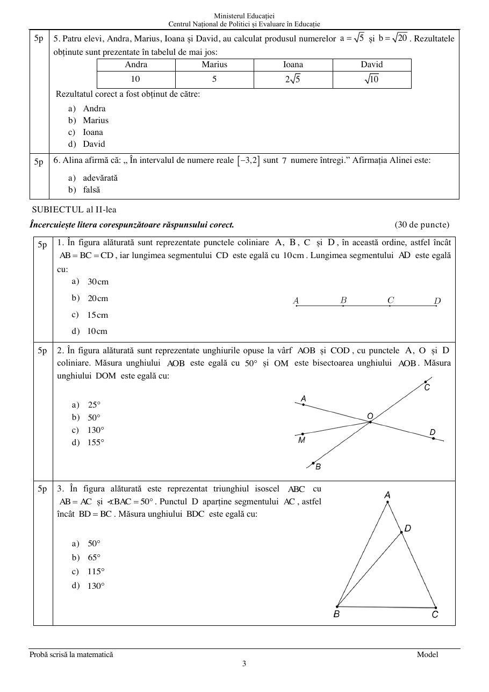
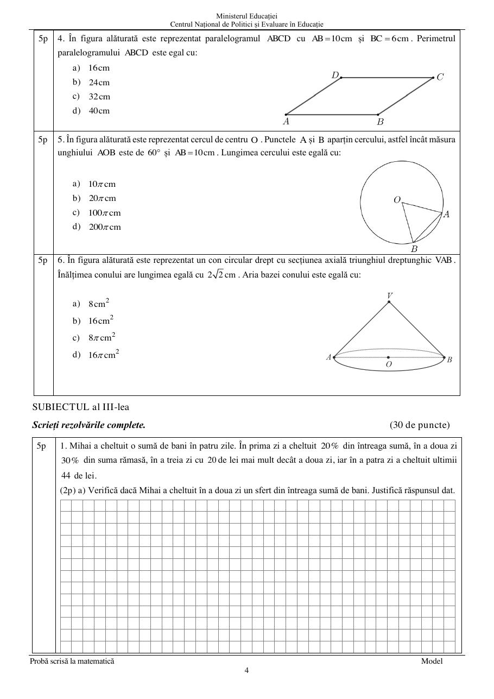
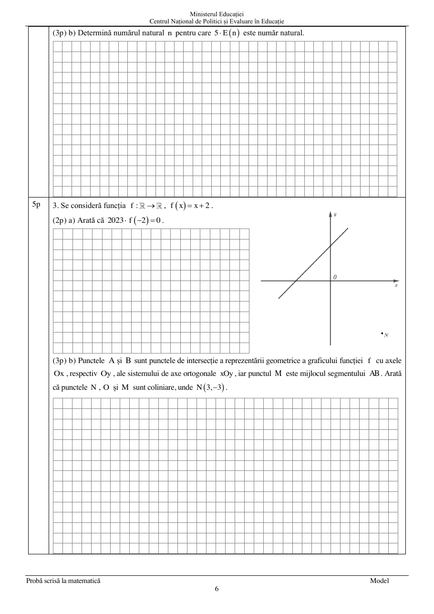
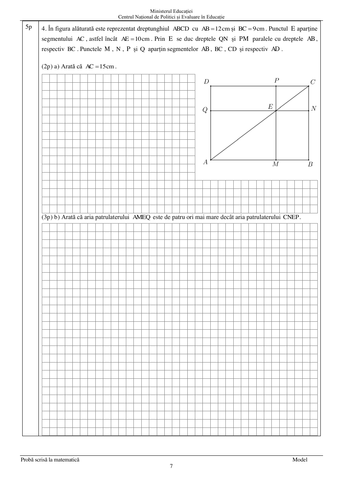
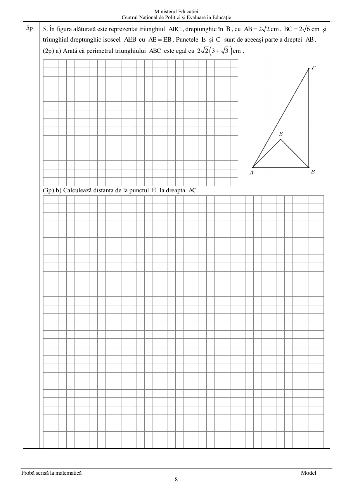
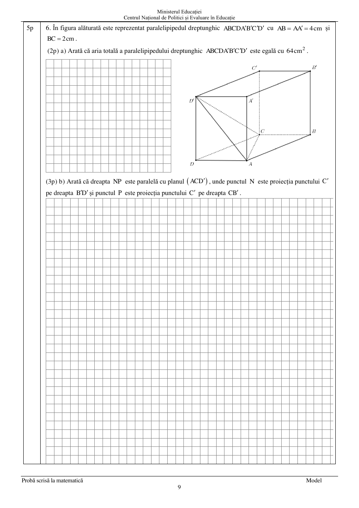

# Evaluarea Națională 2024 — Matematică — Model

## Subiectul I — 30 de puncte

1. Rezultatul calculului $3+2\cdot5$ este: a) $25$; b) $13$; c) $10$; d) $1$.

2. Dacă $\dfrac{x}{2}=\dfrac{3}{4}$, atunci $4x$ este: a) $\dfrac{3}{2}$; b) $\dfrac{8}{3}$; c) $6$; d) $12$.

3. Soluția ecuației $2-x=2$ este: a) $-4$; b) $0$; c) $2$; d) $4$.

4. Cel mai mic element al mulțimii $A=\left\{\dfrac19,\dfrac1{99},\dfrac1{999},\dfrac1{9999}\right\}$ este: a) $\dfrac19$; b) $\dfrac1{99}$; c) $\dfrac1{999}$; d) $\dfrac1{9999}$.

5. Andra, Marius, Ioana și David au calculat produsul numerelor $a=\sqrt5$ și $b=\sqrt{20}$. Rezultatele sunt, în aceeași ordine, $10$, $5$, $2\sqrt5$, $10$. Răspunsul corect este: a) Andra; b) Marius; c) Ioana; d) David.

6. Afirmația „În intervalul $[-3,2]$ sunt 7 numere întregi.” este: a) adevărată; b) falsă.

## Subiectul al II-lea — 30 de puncte

1. Punctele coliniare $A,B,C,D$, în această ordine, verifică $AB=BC=CD$ și $CD=10\,\mathrm{cm}$. Determină $AD$.

   

   a) $30\,\mathrm{cm}$; b) $20\,\mathrm{cm}$; c) $15\,\mathrm{cm}$; d) $10\,\mathrm{cm}$.

2. Unghiurile opuse la vârf $AOB$ și $COD$ au $A,O,D$ coliniare, $\angle AOB=50^\circ$, iar $OM$ este bisectoarea lui $\angle AOB$. Determină $\angle DOM$.

   

   a) $25^\circ$; b) $50^\circ$; c) $130^\circ$; d) $155^\circ$.

3. În triunghiul isoscel $ABC$, $AB=AC$ și $\angle BAC=50^\circ$. Punctul $D$ aparține lui $AC$, iar $BD=BC$. Determină $\angle BDC$.

   

   a) $50^\circ$; b) $65^\circ$; c) $115^\circ$; d) $130^\circ$.

4. Paralelogramul $ABCD$ are $AB=10\,\mathrm{cm}$ și $BC=6\,\mathrm{cm}$. Perimetrul este: a) $16\,\mathrm{cm}$; b) $24\,\mathrm{cm}$; c) $32\,\mathrm{cm}$; d) $40\,\mathrm{cm}$.

   

5. Într-un cerc cu centrul $O$, $\angle AOB=60^\circ$ și $AB=10\,\mathrm{cm}$. Lungimea cercului este: a) $10\pi\,\mathrm{cm}$; b) $20\pi\,\mathrm{cm}$; c) $100\pi\,\mathrm{cm}$; d) $200\pi\,\mathrm{cm}$.

6. Un con circular drept are secțiunea axială triunghiul dreptunghic $VAB$ și înălțimea $2\sqrt2\,\mathrm{cm}$. Aria bazei este: a) $8\,\mathrm{cm}^2$; b) $16\,\mathrm{cm}^2$; c) $8\pi\,\mathrm{cm}^2$; d) $16\pi\,\mathrm{cm}^2$.

## Subiectul al III-lea — 30 de puncte

1. Mihai a cheltuit o sumă în patru zile: $20\%$ din total în prima zi, $30\%$ din rest în a doua zi, cu $20$ de lei mai mult în a treia zi decât în a doua, iar în a patra zi ultimii $44$ de lei. a) Verifică dacă suma din ziua a doua este un sfert din total. b) Determină suma totală.

2. Pentru $x\ne-3$, $x\ne0$, $x\ne3$,

$$E(x)=\left(\dfrac{x-2}{9+3x}+\dfrac{3}{x+3}+\dfrac{2}{3x}\right):\left(\dfrac{x}{3}+\dfrac{3}{x}-2\right).$$

   a) Arată că $\dfrac{x-2}{9+3x}+\dfrac{3}{x+3}+\dfrac{2}{3x}=\dfrac{(x-3)^2}{3x(x+3)}$. b) Determină numărul natural $n$ pentru care $5E(n)$ este număr natural.

3. Se consideră $f:\mathbb R\to\mathbb R$, $f(x)=x+2$. a) Arată că $2023f(-2)=0$. b) Graficul intersectează axele în $A$ și $B$, $M$ este mijlocul lui $AB$, iar $N(3,-3)$. Arată că $N,O,M$ sunt coliniare.

   

4. În dreptunghiul $ABCD$, $AB=12\,\mathrm{cm}$ și $BC=9\,\mathrm{cm}$. Punctul $E\in AC$ verifică $AE=10\,\mathrm{cm}$. Prin $E$ se duc paralele la $AB$, respectiv $BC$, care intersectează laturile în $M,N,P,Q$. a) Arată că $AC=15\,\mathrm{cm}$. b) Arată că aria patrulaterului $AMEQ$ este de patru ori aria patrulaterului $CNEP$.

   

5. Triunghiul $ABC$ este dreptunghic în $B$, $AB=2\sqrt2\,\mathrm{cm}$, $BC=2\sqrt6\,\mathrm{cm}$, iar $AEB$ este dreptunghic isoscel, cu $AE=EB$, în exteriorul lui $ABC$. a) Arată că $P_{ABC}=2\sqrt2(3+\sqrt3)\,\mathrm{cm}$. b) Calculează distanța de la $E$ la dreapta $AC$.

   

6. Paralelipipedul dreptunghic $ABCDA'B'C'D'$ are $AB=AA'=4\,\mathrm{cm}$ și $BC=2\,\mathrm{cm}$. a) Arată că aria totală este $64\,\mathrm{cm}^2$. b) Arată că $NP\parallel(ACD')$, unde $N$ și $P$ sunt proiecțiile lui $C'$ pe dreptele $B'D'$, respectiv $CB'$.

   
