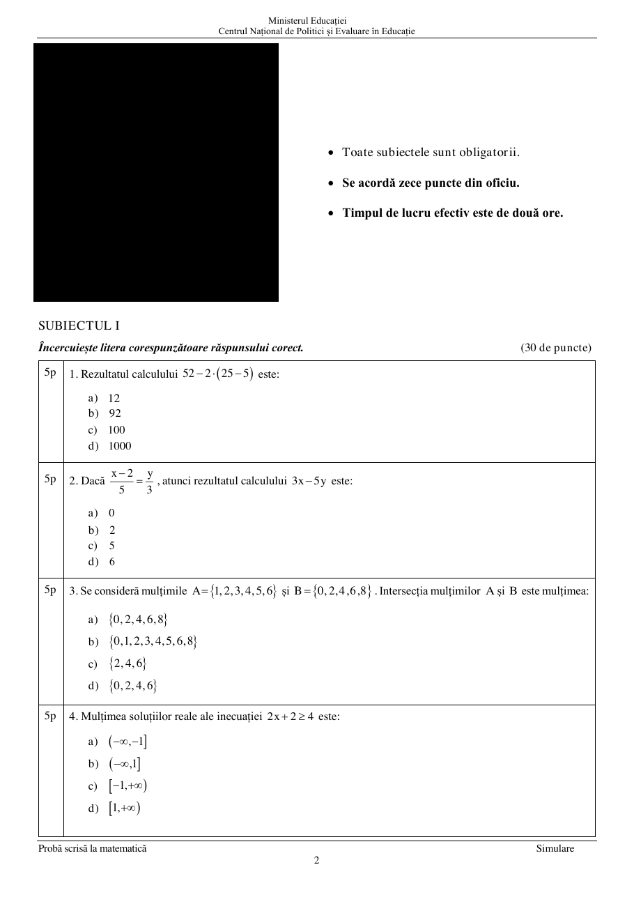

# Evaluarea Națională 2024 — Matematică — Simulare

## Subiectul I — 30 de puncte

1. $5^2-2(25-5)$ este: a) $12$; b) $92$; c) $100$; d) $1000$.

2. Dacă $\dfrac{x-2}{5}=\dfrac{y}{3}$, atunci $3x-5y$ este: a) $0$; b) $2$; c) $5$; d) $6$.

3. Pentru $A=\{1,2,3,4,5,6\}$ și $B=\{0,2,4,6,8\}$, $A\cap B$ este: a) $\{0,2,4,6,8\}$; b) $\{0,1,2,3,4,5,6,8\}$; c) $\{2,4,6\}$; d) $\{0,2,4,6\}$.

4. Mulțimea soluțiilor reale ale inecuației $2x+2\ge4$ este: a) $(-\infty,-1]$; b) $(-\infty,1]$; c) $[-1,+\infty)$; d) $[1,+\infty)$.

5. Pentru $a=2-4\sqrt3+2\sqrt{12}+1$, rezultatele elevilor Ana, Ioan, Dana și Vlad sunt, în aceeași ordine, $0$, $4$, $4\sqrt3$, $8\sqrt3$. Răspunsul corect este: a) Ana; b) Ioan; c) Dana; d) Vlad.

6. Conform diagramei din figura de mai jos, afirmația „jumătate dintre elevi au obținut cel puțin nota 8” este: a) adevărată; b) falsă.

   

## Subiectul al II-lea — 30 de puncte

Figurile subiectului sunt păstrate în [pagina 3](assets/2024_EN_Matematica_Simulare_Subiect_LRO/pagina-03.png) și [pagina 4](assets/2024_EN_Matematica_Simulare_Subiect_LRO/pagina-04.png).

1. Punctele $A,B,C,D$ sunt coliniare, $BC=2AB$, $CD=2BC$, $AB=2\,\mathrm{cm}$, iar $M$ și $N$ sunt mijloacele segmentelor $AB$, respectiv $CD$. Determină $MN$.

   a) $4\,\mathrm{cm}$; b) $5\,\mathrm{cm}$; c) $7\,\mathrm{cm}$; d) $9\,\mathrm{cm}$.

2. Unghiurile adiacente $AOB$ și $BOC$ sunt complementare, $OM$ este bisectoarea lui $AOB$, iar $\angle BOC=3\angle AOM$. Determină $\angle AOB$.

   a) $18^\circ$; b) $36^\circ$; c) $40^\circ$; d) $54^\circ$.

3. În triunghiul $ABC$, $AB=10\,\mathrm{cm}$, $AC=12\,\mathrm{cm}$, iar bisectoarele din $B$ și $C$ se intersectează în $I$. Paralela prin $I$ la $BC$ intersectează $AB$, $AC$ în $D$, respectiv $E$. Determină perimetrul triunghiului $ADE$.

   a) $11\,\mathrm{cm}$; b) $20\,\mathrm{cm}$; c) $22\,\mathrm{cm}$; d) $24\,\mathrm{cm}$.

4. În dreptunghiul $ABCD$, $AB=3\sqrt2\,\mathrm{cm}$, triunghiul $BEC$ este dreptunghic în $E$, $F$ este mijlocul lui $BC$, iar $EF=4\,\mathrm{cm}$. Aria trapezului $AFCD$ este: a) $6\sqrt2$; b) $12\sqrt2$; c) $18\sqrt2$; d) $24\sqrt2\,\mathrm{cm}^2$.

5. Un cerc are centrul $O$ și raza $3\,\mathrm{cm}$. Punctul $P$ este la $6\,\mathrm{cm}$ de $O$, iar $PA$ și $PB$ sunt tangente. Măsura arcului mic $AB$ este: a) $60^\circ$; b) $90^\circ$; c) $120^\circ$; d) $150^\circ$.

6. În piramida patrulateră regulată $VABCD$, $VA=AB$, $O=AC\cap BD$, iar $M$ este mijlocul lui $VB$. Măsura unghiului dreptelor $OM$ și $CD$ este: a) $0^\circ$; b) $30^\circ$; c) $45^\circ$; d) $60^\circ$.

## Subiectul al III-lea — 30 de puncte

Figurile sunt păstrate în [paginile 7–9](assets/2024_EN_Matematica_Simulare_Subiect_LRO/pagina-07.png).

1. Maria are cărți care, grupate câte $8$, câte $12$ sau câte $18$, lasă de fiecare dată restul $5$. a) Verifică dacă poate avea $53$ de cărți. b) Determină cel mai mic număr natural de trei cifre cu această proprietate.

2. Se consideră

$$E(x)=(2x+3)^2+(x-2)(x+2)-3(1-x)+2.$$

   a) Arată că $E(0)=4$. b) Arată că $N=E(n)+6$ este divizibil cu $10$ pentru orice $n\in\mathbb N$.

3. Se consideră numărul natural de trei cifre $\overline{abc}$, cu cifre nenule,

$$a=5\left(\dfrac12+\dfrac13+\dfrac16\right)-\dfrac23:\dfrac13,$$

$$b=3\cdot(3^2\cdot3^3\cdot3^4):9^4-25^4:5^7.$$

   a) Arată că $a=3$. b) Determină $\overline{abc}$, știind că numerele $\overline{ac}$ și $\overline{cb}$ sunt direct proporționale cu $4$ și $3$.

4. În triunghiul dreptunghic $ABC$, $\angle A=90^\circ$, $\angle B=40^\circ$, $BE$ este bisectoare, $E\in AC$. Perpendiculara din $A$ pe $BC$ intersectează $BC$ în $D$, iar cea din $E$ în $F$; $M=BE\cap AD$. a) Arată că $\angle EMA=70^\circ$. b) Arată că $AMFE$ este romb.

5. În paralelogramul $ABCD$, $AB=15\,\mathrm{cm}$, $P\in AB$, $PB=2AP$, iar $O=AC\cap BD$. Dacă $N=AC\cap DP$: a) arată că $AP=5\,\mathrm{cm}$; b) determină $\dfrac{[ANP]}{[DNO]}$.

6. În cubul $ABCDA'B'C'D'$, punctele $M,N,P,Q$ sunt mijloacele segmentelor $AA'$, $A'D'$, $DD'$, respectiv $AD$. a) Arată că $MN=PQ$. b) Dacă $T$ este mijlocul lui $PQ$, demonstrează că $CT\parallel(MNB)$.

## Figuri și pagini scanate

Imaginile aparțin exact acestui subiect și sunt păstrate în folderul cu același nume:

- [Pagina 3](assets/2024_EN_Matematica_Simulare_Subiect_LRO/pagina-03.png) · [Pagina 4](assets/2024_EN_Matematica_Simulare_Subiect_LRO/pagina-04.png)
- [Pagina 5](assets/2024_EN_Matematica_Simulare_Subiect_LRO/pagina-05.png) · [Pagina 6](assets/2024_EN_Matematica_Simulare_Subiect_LRO/pagina-06.png)
- [Pagina 7](assets/2024_EN_Matematica_Simulare_Subiect_LRO/pagina-07.png) · [Pagina 8](assets/2024_EN_Matematica_Simulare_Subiect_LRO/pagina-08.png)
- [Pagina 9](assets/2024_EN_Matematica_Simulare_Subiect_LRO/pagina-09.png) · [Pagina 10](assets/2024_EN_Matematica_Simulare_Subiect_LRO/pagina-10.png)
