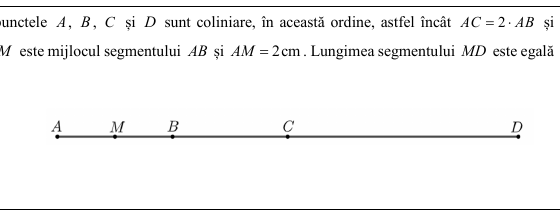
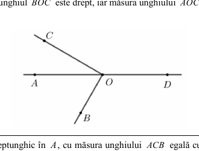
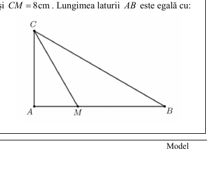
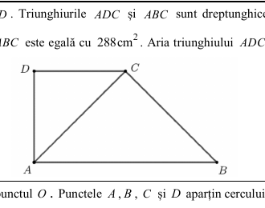
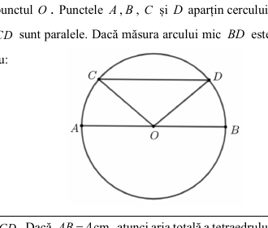
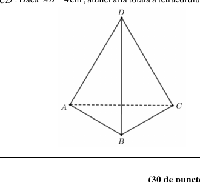
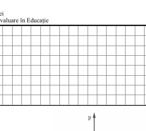
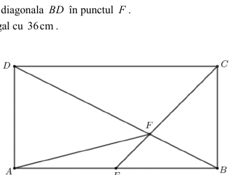
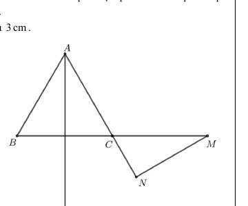
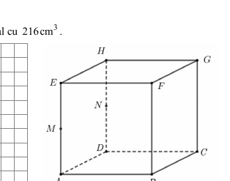

# Evaluarea Națională 2025 — Matematică — Model

## Subiectul I — 30 de puncte

Încercuiește litera corespunzătoare răspunsului corect.

1. Rezultatul calculului $(40+2\cdot5):5$ este: a) $6$; b) $10$; c) $38$; d) $42$.

2. Dacă $\dfrac{x}{9}=\dfrac{2}{3}$, atunci $x$ este: a) $\dfrac{27}{2}$; b) $6$; c) $2$; d) $\dfrac{1}{6}$.

3. Pentru $A=\{0,1,2,3,4,5\}$ și $B=\{2,4,6,8\}$, mulțimea $A\cup B$ este: a) $\{2,4\}$; b) $\{0,1,3,5\}$; c) $\{1,2,3,4,5,6,8\}$; d) $\{0,1,2,3,4,5,6,8\}$.

4. Scrierea zecimală a lui $\dfrac{5}{6}$ este: a) $0,8$; b) $0,83$; c) $0,8(3)$; d) $0,(83)$.

5. Patru elevi au calculat media aritmetică a numerelor $a=\sqrt{3^2+4^2}$ și $b=45$. Rezultatele sunt: Alina — $15$, Bogdan — $25$, Corina — $26$, Dan — $50$. Rezultatul corect a fost obținut de: a) Alina; b) Bogdan; c) Corina; d) Dan.

6. Pentru $a=11-5\sqrt{5}$, enunțul „Numărul real $a$ este pozitiv.” este: a) adevărat; b) fals.

## Subiectul al II-lea — 30 de puncte

1. Punctele $A,B,C,D$ sunt coliniare, în această ordine, $AC=2\cdot AB$, $AD=2\cdot AC$, iar $M$ este mijlocul lui $AB$, cu $AM=2\,\mathrm{cm}$. Determină $MD$.

   

   a) $4\,\mathrm{cm}$; b) $6\,\mathrm{cm}$; c) $14\,\mathrm{cm}$; d) $16\,\mathrm{cm}$.

2. Punctele $A,O,D$ sunt coliniare, $\angle BOC=90^\circ$ și $\angle AOC=30^\circ$. Determină $\angle BOD$.

   

   a) $120^\circ$; b) $130^\circ$; c) $150^\circ$; d) $180^\circ$.

3. Triunghiul $ABC$ este dreptunghic în $A$, $\angle ACB=60^\circ$, iar $CM$ este bisectoarea lui $\angle ACB$, cu $CM=8\,\mathrm{cm}$. Determină $AB$.

   

   a) $4\sqrt{3}\,\mathrm{cm}$; b) $8\,\mathrm{cm}$; c) $12\,\mathrm{cm}$; d) $8\sqrt{3}\,\mathrm{cm}$.

4. În patrulaterul $ABCD$, triunghiurile $ADC$ și $ABC$ sunt dreptunghice isoscele, $AD=CD$, $AC=BC$, iar aria lui $ABC$ este $288\,\mathrm{cm}^2$. Determină aria lui $ADC$.

   

   a) $72\,\mathrm{cm}^2$; b) $144\,\mathrm{cm}^2$; c) $288\,\mathrm{cm}^2$; d) $576\,\mathrm{cm}^2$.

5. Într-un cerc cu centrul $O$, $O\in AB$, $AB\parallel CD$, iar arcul mic $BD$ are măsura $40^\circ$. Determină $\angle COD$.

   

   a) $40^\circ$; b) $60^\circ$; c) $80^\circ$; d) $100^\circ$.

6. Pentru tetraedrul regulat $ABCD$ cu $AB=4\,\mathrm{cm}$, determină aria totală.

   

   a) $4\sqrt{3}\,\mathrm{cm}^2$; b) $8\sqrt{3}\,\mathrm{cm}^2$; c) $24\,\mathrm{cm}^2$; d) $16\sqrt{3}\,\mathrm{cm}^2$.

## Subiectul al III-lea — 30 de puncte

1. O echipă construiește o pistă în 3 zile: în prima zi $30\%$ din lungime, în a doua zi $60\%$ din ce a rămas, iar în ultima zi cu $7\,\mathrm{km}$ mai puțin decât în a doua zi. a) Compară primele două zile. b) Determină lungimea pistei.

2. Pentru $x\ne-4$ și $x\ne3$,

$$E(x)=\left(\dfrac{x+4}{x-3}-\dfrac{x-3}{x+4}+2\right):\dfrac{7}{x^2+x-12}.$$

a) Arată că $x^2+x-12=(x-3)(x+4)$. b) Determină $N=E(2)+E(4)+E(6)+\cdots+E(16)$.

3. Se consideră $f:\mathbb{R}\to\mathbb{R}$, $f(x)=2x-6$. a) Arată că $f(3)\cdot f(2025)=0$. b) Graficul intersectează axele în $A$, respectiv $B$; dacă $M$ este simetricul lui $A$ față de $O$, determină aria triunghiului $ABM$.

   

4. În dreptunghiul $ABCD$, $AB=12\,\mathrm{cm}$ și $BC=6\,\mathrm{cm}$. Bisectoarea lui $\angle BCD$ intersectează $AB$ în $E$ și diagonala $BD$ în $F$. a) Arată că $P_{ABCD}=36\,\mathrm{cm}$. b) Calculează $AF$.

   

5. Triunghiul echilateral $ABC$ are $AB=6\,\mathrm{cm}$. Punctele $B,C,M$ sunt coliniare, $C$ este mijlocul lui $BM$, $N$ este proiecția lui $M$ pe $AC$, iar $BC$ este mediatoarea lui $AP$. a) Arată că $NC=3\,\mathrm{cm}$. b) Demonstrează că $M,N,P$ sunt coliniare.

   

6. În cubul $ABCDEFGH$, $AB=6\,\mathrm{cm}$, iar $M,N$ sunt mijloacele muchiilor $AE$, respectiv $DH$. a) Arată că volumul este $216\,\mathrm{cm}^3$. b) Calculează distanța de la $H$ la planul $(CMN)$.

   

## Figuri și pagini scanate

Imaginile aparțin exact acestui subiect și sunt păstrate în folderul cu același nume:

- [Pagina 3](assets/2025_EN_Matematica_Model_Subiect_LRO/pagina-03.png) · [Pagina 4](assets/2025_EN_Matematica_Model_Subiect_LRO/pagina-04.png)
- [Pagina 5](assets/2025_EN_Matematica_Model_Subiect_LRO/pagina-05.png) · [Pagina 6](assets/2025_EN_Matematica_Model_Subiect_LRO/pagina-06.png)
- [Pagina 7](assets/2025_EN_Matematica_Model_Subiect_LRO/pagina-07.png) · [Pagina 8](assets/2025_EN_Matematica_Model_Subiect_LRO/pagina-08.png)
- [Pagina 9](assets/2025_EN_Matematica_Model_Subiect_LRO/pagina-09.png) · [Pagina 10](assets/2025_EN_Matematica_Model_Subiect_LRO/pagina-10.png)
