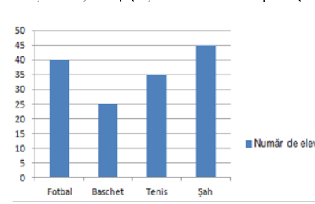
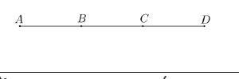
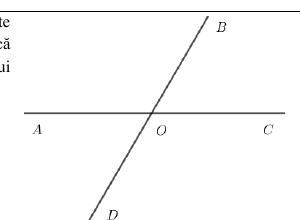
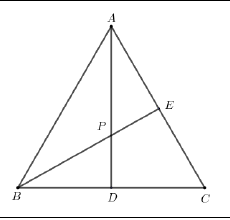
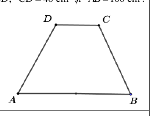
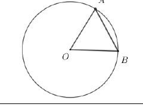
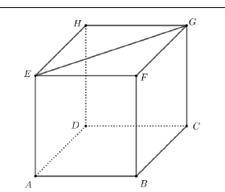
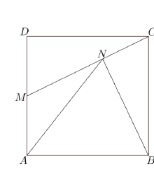
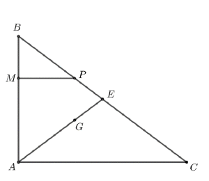
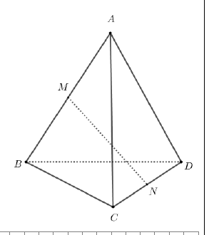

# Evaluarea Națională 2025 — Matematică

## Simulare — Subiect

**Anul școlar 2024–2025**

*Transcriere și formatare manuală după PDF-ul original. Figurile sunt păstrate separat în folderul de imagini al acestei variante.*

## SUBIECTUL I

**Încercuiește litera corespunzătoare răspunsului corect. (30 de puncte)**

### 1. (5p)

Rezultatul calculului $25-2\cdot5$ este egal cu:

**a)** $10$  
**b)** $15$  
**c)** $35$  
**d)** $115$

### 2. (5p)

Numărul care reprezintă $10\%$ din $50$ este egal cu:

**a)** $40$  
**b)** $10$  
**c)** $5$  
**d)** $1$

### 3. (5p)

Dimineața, temperatura aerului a fost de $-1^\circ\text{C}$, iar la prânz a fost de $+2^\circ\text{C}$. Temperatura măsurată la prânz a fost mai mare decât temperatura măsurată dimineața cu:

**a)** $-3^\circ\text{C}$  
**b)** $-1^\circ\text{C}$  
**c)** $1^\circ\text{C}$  
**d)** $3^\circ\text{C}$

### 4. (5p)

Soluția ecuației

$$
x+\frac{1}{4}=\frac{1}{2}
$$

este:

**a)** $\frac{1}{6}$  
**b)** $\frac{1}{4}$  
**c)** $\frac{1}{2}$  
**d)** $\frac{3}{4}$

### 5. (5p)

Patru elevi, Andreea, Iris, Mihai și Radu, calculează media aritmetică a numerelor

$$
a=4-\sqrt{2}
\qquad\text{și}\qquad
b=4+\sqrt{2}.
$$

Rezultatele sunt prezentate în tabel:

| Andreea | Iris | Mihai | Radu |
|:---:|:---:|:---:|:---:|
| $4$ | $\sqrt{2}$ | $2$ | $\sqrt{14}$ |

Rezultatul corect a fost obținut de:

**a)** Andreea  
**b)** Iris  
**c)** Mihai  
**d)** Radu

### 6. (5p)

În diagrama de mai jos sunt prezentate numerele de elevi care au optat pentru fotbal, baschet, tenis și șah.

Afirmația „Numărul elevilor care au optat pentru fotbal este egal cu numărul elevilor care au optat pentru șah” este:

**a)** adevărată  
**b)** falsă

## SUBIECTUL al II-lea

**Încercuiește litera corespunzătoare răspunsului corect. (30 de puncte)**

### 1. (5p)

Punctele distincte și coliniare $A$, $B$, $C$ și $D$ sunt în această ordine. Segmentele $AB$, $BC$ și $CD$ sunt congruente, iar $AD=24\text{ cm}$. Lungimea segmentului $CD$ este egală cu:

**a)** $4\text{ cm}$  
**b)** $6\text{ cm}$  
**c)** $8\text{ cm}$  
**d)** $12\text{ cm}$

### 2. (5p)

În figura alăturată sunt reprezentate unghiurile adiacente suplementare $AOB$ și $BOC$. Știind că $\angle BOC=60^\circ$ și că semidreapta $OD$ este opusă semidreptei $OB$, măsura unghiului $DOC$ este egală cu:

**a)** $160^\circ$  
**b)** $120^\circ$  
**c)** $60^\circ$  
**d)** $30^\circ$

### 3. (5p)

În figura alăturată este reprezentat triunghiul echilateral $ABC$. Semidreapta $BE$ este bisectoarea unghiului $ABC$, iar punctul $D$ este mijlocul segmentului $BC$. Dreptele $AD$ și $BE$ se intersectează în punctul $P$. Măsura unghiului $DPE$ este egală cu:

**a)** $30^\circ$  
**b)** $60^\circ$  
**c)** $120^\circ$  
**d)** $150^\circ$

### 4. (5p)

În figura alăturată este reprezentat trapezul isoscel $ABCD$, cu $AB\parallel CD$, $CD=40\text{ cm}$ și $AB=100\text{ cm}$. Lungimea liniei mijlocii a trapezului $ABCD$ este egală cu:

**a)** $20\text{ cm}$  
**b)** $50\text{ cm}$  
**c)** $70\text{ cm}$  
**d)** $140\text{ cm}$

### 5. (5p)

În figura alăturată este reprezentat cercul de centru $O$. Punctele $A$ și $B$ sunt situate pe cerc, astfel încât $\angle AOB=60^\circ$ și $AB=12\text{ cm}$. Aria discului de centru $O$ și rază $OA$ este egală cu:

**a)** $288\pi\text{ cm}^2$  
**b)** $144\pi\text{ cm}^2$  
**c)** $36\pi\text{ cm}^2$  
**d)** $24\pi\text{ cm}^2$

### 6. (5p)

În figura alăturată este reprezentat cubul $ABCDEFGH$. Lungimea segmentului $EG$ este egală cu $4\sqrt{2}\text{ cm}$. Suma lungimilor tuturor muchiilor cubului este egală cu:

**a)** $96\text{ cm}$  
**b)** $72\text{ cm}$  
**c)** $48\text{ cm}$  
**d)** $16\text{ cm}$

## SUBIECTUL al III-lea

**Scrie rezolvările complete. (30 de puncte)**

### 1. (5p)

Un bunic dorește să împartă suma de $126$ de lei celor trei nepoți ai săi: Ana, Bogdan și Costin. Ana va primi jumătate din suma pe care o vor primi împreună Bogdan și Costin.

**a) (2p)** Verifică dacă Ana poate primi $40$ de lei. Justifică răspunsul dat.

**b) (3p)** Determină suma pe care o va primi Bogdan, știind că este cu $10\%$ mai mare decât suma pe care o va primi Costin.

### 2. (5p)

Se consideră expresia

$$
E(x)=
\left(
\frac{x-1}{x+1}
+\frac{x+1}{x-1}
-2
\right)
:\frac{4}{x^2+x-2},
$$

unde $x$ este număr real, $x\ne-2$, $x\ne-1$ și $x\ne1$.

**a) (2p)** Arată că

$$
(x-1)(x+2)=x^2+x-2,
$$

pentru orice număr real $x$.

**b) (3p)** Arată că numărul

$$
N=E(2)\cdot E(3)\cdot\ldots\cdot E(9)\cdot E(10)
$$

este natural.

### 3. (5p)

În sistemul de axe ortogonale $xOy$ se consideră punctele $A(2,0)$ și $B(6,3)$.

**a) (2p)** Arată că $AB=5$.

**b) (3p)** Calculează distanța de la punctul $M(5,0)$ la dreapta $AB$.

### 4. (5p)

În figura alăturată este reprezentat pătratul $ABCD$, cu $AB=10\text{ cm}$. Punctul $M$ este mijlocul segmentului $AD$, iar punctul $N$ este proiecția punctului $B$ pe dreapta $CM$.

**a) (2p)** Arată că aria triunghiului $MBC$ este egală cu $50\text{ cm}^2$.

**b) (3p)** Arată că perimetrul triunghiului $MAN$ este mai mic decât $22\text{ cm}$.

### 5. (5p)

În figura alăturată este reprezentat triunghiul $ABC$, dreptunghic în $A$, cu $AB=9\text{ cm}$ și $AC=12\text{ cm}$. Punctul $M$ se află pe latura $AB$, $BM=3\text{ cm}$. Paralela prin $M$ la dreapta $AC$ intersectează dreapta $BC$ în punctul $P$, punctul $G$ este centrul de greutate al triunghiului $ABC$, iar $E$ este punctul de intersecție al dreptelor $AG$ și $BC$.

**a) (2p)** Arată că $BC=15\text{ cm}$.

**b) (3p)** Calculează aria patrulaterului $MGEP$.

### 6. (5p)

În figura alăturată este reprezentat tetraedrul regulat $ABCD$, cu $AB=20\text{ cm}$, iar punctele $M$ și $N$ sunt mijloacele muchiilor $AB$, respectiv $CD$.

**a) (2p)** Arată că $MN=10\sqrt{2}\text{ cm}$.

**b) (3p)** Determină măsura unghiului dreptelor $MN$ și $BD$.

## Figuri și pagini scanate

Imaginile aparțin exact acestui subiect și sunt păstrate în folderul cu același nume:

- [Pagina 3](assets/2025_EN_Matematica_Simulare_Subiect_LRO/pagina-03.png) · [Pagina 4](assets/2025_EN_Matematica_Simulare_Subiect_LRO/pagina-04.png)
- [Pagina 5](assets/2025_EN_Matematica_Simulare_Subiect_LRO/pagina-05.png) · [Pagina 6](assets/2025_EN_Matematica_Simulare_Subiect_LRO/pagina-06.png)
- [Pagina 7](assets/2025_EN_Matematica_Simulare_Subiect_LRO/pagina-07.png) · [Pagina 8](assets/2025_EN_Matematica_Simulare_Subiect_LRO/pagina-08.png)
- [Pagina 9](assets/2025_EN_Matematica_Simulare_Subiect_LRO/pagina-09.png) · [Pagina 10](assets/2025_EN_Matematica_Simulare_Subiect_LRO/pagina-10.png)
