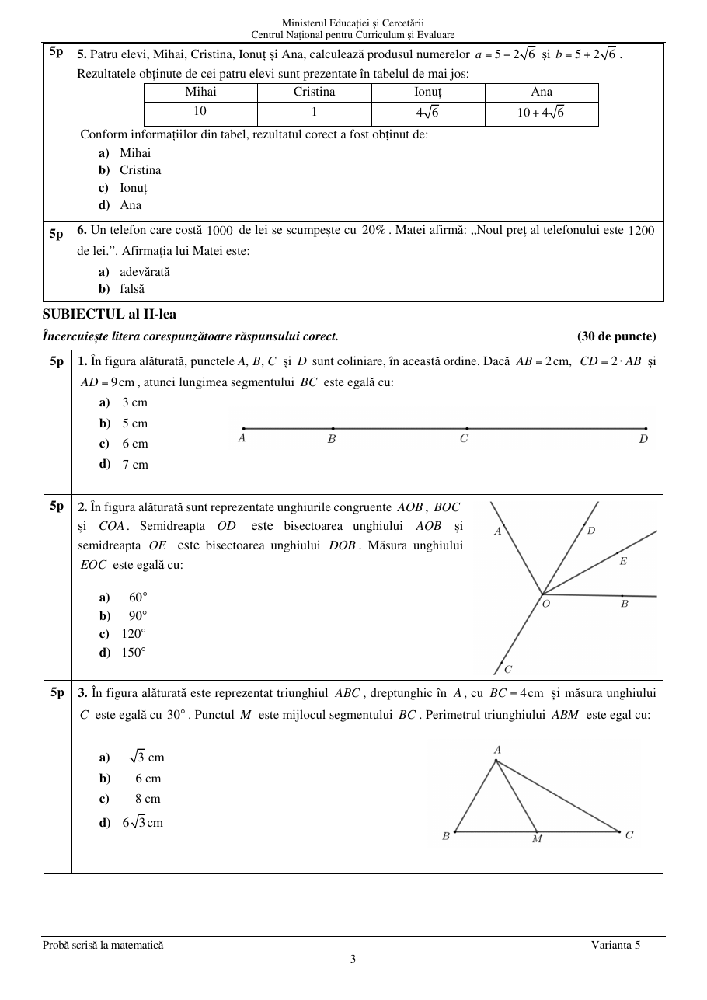
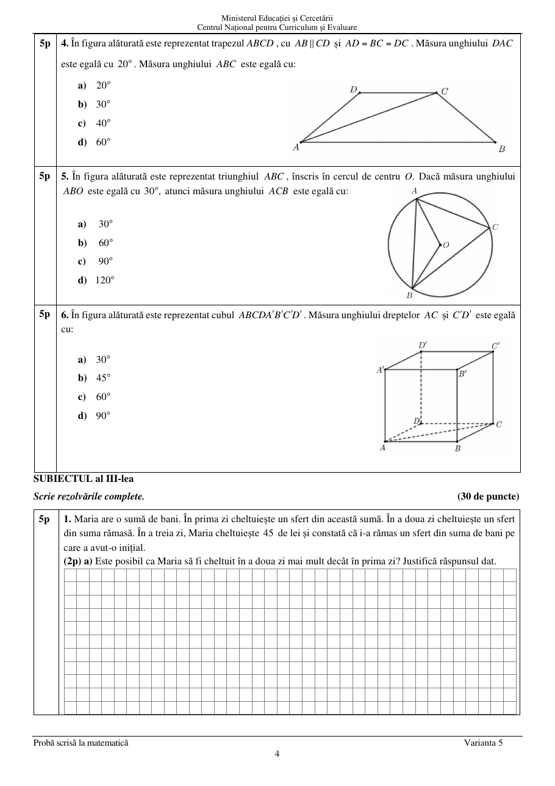
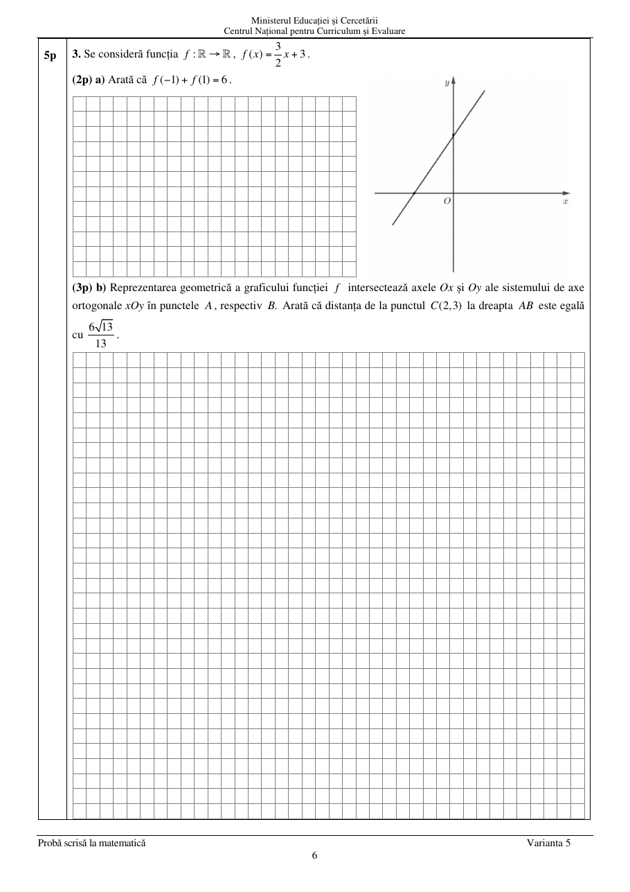
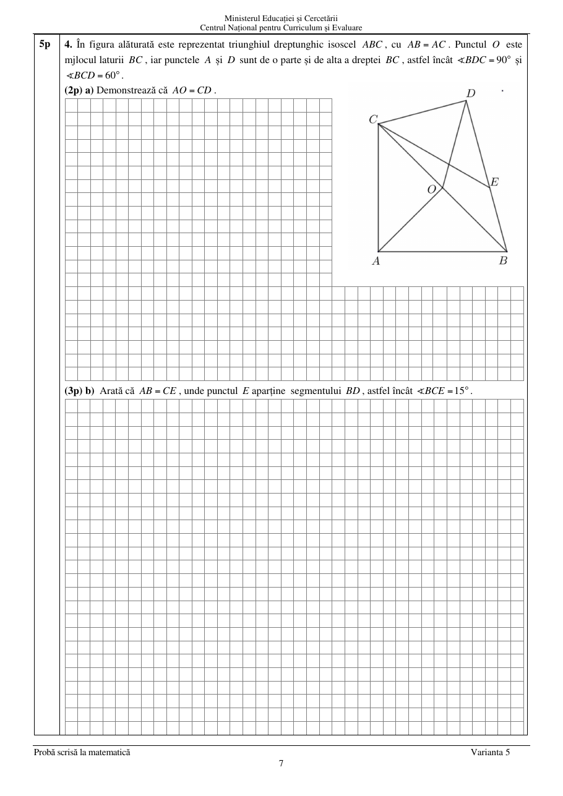
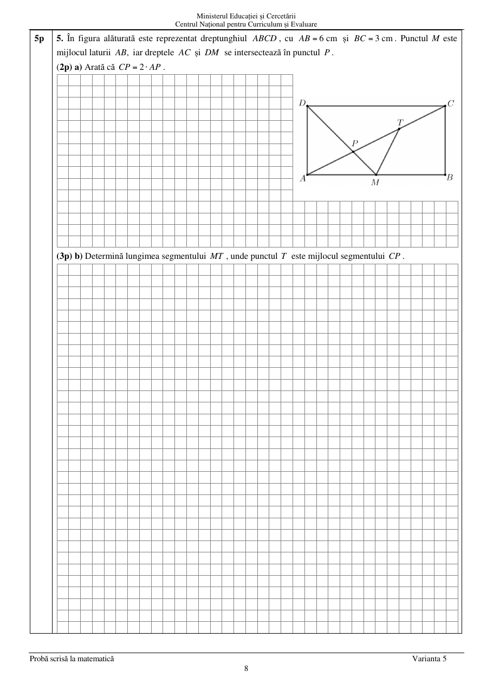
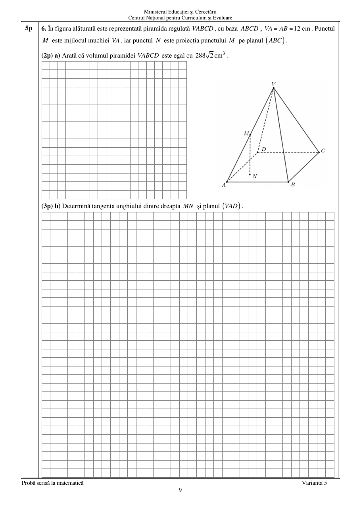

# Evaluarea Națională 2026 — Matematică

## Rezerva examenului — Varianta 5

**Anul școlar 2025–2026**

*Transcriere și formatare manuală după PDF-ul original. Paginile originale cu figuri sunt păstrate în folderul de imagini al acestei variante.*

## SUBIECTUL I

**Încercuiește litera corespunzătoare răspunsului corect. (30 de puncte)**

### 1. (5p)

Rezultatul calculului $27-24:3$ este egal cu:

**a)** $19$  
**b)** $17$  
**c)** $1$  
**d)** $0$

### 2. (5p)

Știind că

$$
\frac{a}{3}=\frac{b}{4}=5,
$$

rezultatul calculului $a+b$ este egal cu:

**a)** $7$  
**b)** $10$  
**c)** $12$  
**d)** $35$

### 3. (5p)

Soluția ecuației $5-x=5$ este numărul:

**a)** $-10$  
**b)** $-1$  
**c)** $0$  
**d)** $10$

### 4. (5p)

Inversul numărului

$$
\frac{5}{9}
$$

este numărul:

**a)** $-\frac{9}{5}$  
**b)** $-\frac{5}{9}$  
**c)** $\frac{5}{9}$  
**d)** $\frac{9}{5}$

### 5. (5p)

Patru elevi, Mihai, Cristina, Ionuț și Ana, calculează produsul numerelor

$$
a=5-2\sqrt{6}
\qquad\text{și}\qquad
b=5+2\sqrt{6}.
$$

Rezultatele obținute sunt prezentate în tabel:

| Mihai | Cristina | Ionuț | Ana |
|:---:|:---:|:---:|:---:|
| $10$ | $1$ | $4\sqrt{6}$ | $10+4\sqrt{6}$ |

Conform informațiilor din tabel, rezultatul corect a fost obținut de:

**a)** Mihai  
**b)** Cristina  
**c)** Ionuț  
**d)** Ana

### 6. (5p)

Un telefon care costă $1000$ de lei se scumpește cu $20\%$. Matei afirmă: „Noul preț al telefonului este $1200$ de lei.” Afirmația lui Matei este:

**a)** adevărată  
**b)** falsă

## SUBIECTUL al II-lea

**Încercuiește litera corespunzătoare răspunsului corect. (30 de puncte)**

### 1. (5p)

În figura alăturată, punctele $A$, $B$, $C$ și $D$ sunt coliniare, în această ordine. Dacă $AB=2\text{ cm}$, $CD=2\cdot AB$ și $AD=9\text{ cm}$, atunci lungimea segmentului $BC$ este egală cu:

**a)** $3\text{ cm}$  
**b)** $5\text{ cm}$  
**c)** $6\text{ cm}$  
**d)** $7\text{ cm}$

### 2. (5p)

În figura alăturată sunt reprezentate unghiurile congruente $AOB$, $BOC$ și $COA$. Semidreapta $OD$ este bisectoarea unghiului $AOB$, iar semidreapta $OE$ este bisectoarea unghiului $DOB$. Măsura unghiului $EOC$ este egală cu:

**a)** $60^\circ$  
**b)** $90^\circ$  
**c)** $120^\circ$  
**d)** $150^\circ$

### 3. (5p)

În figura alăturată este reprezentat triunghiul $ABC$, dreptunghic în $A$, cu $BC=4\text{ cm}$ și măsura unghiului $C$ egală cu $30^\circ$. Punctul $M$ este mijlocul segmentului $BC$. Perimetrul triunghiului $ABM$ este egal cu:

**a)** $3\text{ cm}$  
**b)** $6\text{ cm}$  
**c)** $8\text{ cm}$  
**d)** $6\sqrt{3}\text{ cm}$

### 4. (5p)

În figura alăturată este reprezentat trapezul $ABCD$, cu $AB\parallel CD$ și $AD=BC=DC$. Măsura unghiului $DAC$ este egală cu $20^\circ$. Măsura unghiului $ABC$ este egală cu:

**a)** $20^\circ$  
**b)** $30^\circ$  
**c)** $40^\circ$  
**d)** $60^\circ$

### 5. (5p)

În figura alăturată este reprezentat triunghiul $ABC$, înscris în cercul de centru $O$. Dacă măsura unghiului $ABO$ este egală cu $30^\circ$, atunci măsura unghiului $ACB$ este egală cu:

**a)** $30^\circ$  
**b)** $60^\circ$  
**c)** $90^\circ$  
**d)** $120^\circ$

### 6. (5p)

În figura alăturată este reprezentat cubul $ABCDA'B'C'D'$. Măsura unghiului dreptelor $AC$ și $C'D'$ este egală cu:

**a)** $30^\circ$  
**b)** $45^\circ$  
**c)** $60^\circ$  
**d)** $90^\circ$

## SUBIECTUL al III-lea

**Scrie rezolvările complete. (30 de puncte)**

### 1. (5p)

Maria are o sumă de bani. În prima zi cheltuiește un sfert din această sumă. În a doua zi cheltuiește un sfert din suma rămasă. În a treia zi, Maria cheltuiește $45$ de lei și constată că i-a rămas un sfert din suma de bani pe care a avut-o inițial.

**a) (2p)** Este posibil ca Maria să fi cheltuit în a doua zi mai mult decât în prima zi? Justifică răspunsul dat.

**b) (3p)** Determină suma de bani pe care a avut-o Maria inițial.

### 2. (5p)

Se consideră expresia

$$
E(x)=
\left(
\frac{7}{x^2-4}
+\frac{2}{x-2}
+\frac{3}{x+2}
\right)
:\frac{5(x^2+2x+1)}{x-2},
$$

unde $x$ este număr real, $x\ne-2$, $x\ne-1$ și $x\ne2$.

**a) (2p)** Arată că

$$
\frac{7}{x^2-4}
+\frac{2}{x-2}
+\frac{3}{x+2}
=\frac{5(x+1)}{(x-2)(x+2)},
$$

pentru orice număr real $x$, $x\ne-2$ și $x\ne2$.

**b) (3p)** Determină numărul natural $n$, $n\ne2$, pentru care

$$
E(n)=\frac{1}{6}.
$$

### 3. (5p)

Se consideră funcția $f:\mathbb{R}\to\mathbb{R}$,

$$
f(x)=\frac{3}{2}x+3.
$$

**a) (2p)** Arată că

$$
f(-1)+f(1)=6.
$$

**b) (3p)** Reprezentarea geometrică a graficului funcției $f$ intersectează axele $Ox$ și $Oy$ ale sistemului de axe ortogonale $xOy$ în punctele $A$, respectiv $B$. Arată că distanța de la punctul $C(2,3)$ la dreapta $AB$ este egală cu

$$
\frac{6\sqrt{13}}{13}.
$$

### 4. (5p)

În figura alăturată este reprezentat triunghiul dreptunghic isoscel $ABC$, cu $AB=AC$. Punctul $O$ este mijlocul laturii $BC$, iar punctele $A$ și $D$ sunt de o parte și de alta a dreptei $BC$, astfel încât $\angle BDC=90^\circ$ și $\angle BCD=60^\circ$.

**a) (2p)** Demonstrează că $AO=CD$.

**b) (3p)** Arată că $AB=CE$, unde punctul $E$ aparține segmentului $BD$, astfel încât $\angle BCE=15^\circ$.

### 5. (5p)

În figura alăturată este reprezentat dreptunghiul $ABCD$, cu $AB=6\text{ cm}$ și $BC=3\text{ cm}$. Punctul $M$ este mijlocul laturii $AB$, iar dreptele $AC$ și $DM$ se intersectează în punctul $P$.

**a) (2p)** Arată că

$$
CP=2\cdot AP.
$$

**b) (3p)** Determină lungimea segmentului $MT$, unde punctul $T$ este mijlocul segmentului $CP$.

### 6. (5p)

În figura alăturată este reprezentată piramida regulată $VABCD$, cu baza $ABCD$, $VA=AB=12\text{ cm}$. Punctul $M$ este mijlocul muchiei $VA$, iar punctul $N$ este proiecția punctului $M$ pe planul $(ABC)$.

**a) (2p)** Arată că volumul piramidei $VABCD$ este egal cu

$$
288\sqrt{2}\text{ cm}^3.
$$

**b) (3p)** Determină tangenta unghiului dintre dreapta $MN$ și planul $(VAD)$.

