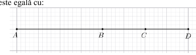
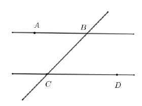
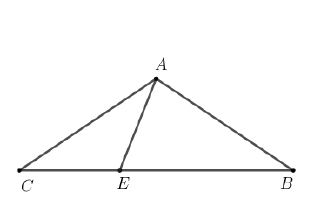
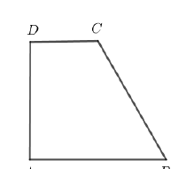
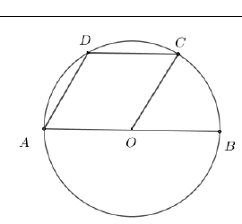
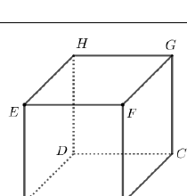
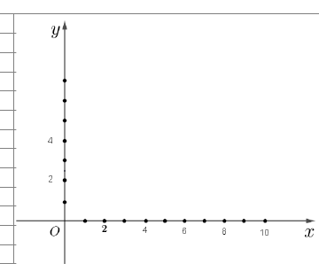
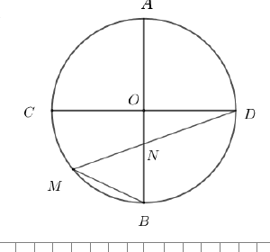
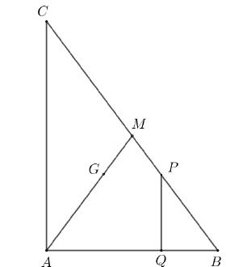
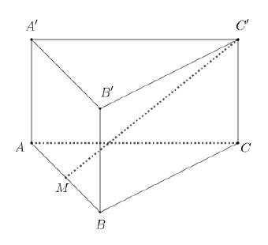

# Evaluarea Națională 2026 — Matematică

## Simulare 2 — Subiect

**Anul școlar 2025–2026**

*Transcriere și formatare manuală după PDF-ul original. Figurile sunt păstrate separat în folderul de imagini al acestei variante.*

## SUBIECTUL I

**Încercuiește litera corespunzătoare răspunsului corect. (30 de puncte)**

### 1. (5p)

Rezultatul calculului $39-9:3$ este egal cu:

**a)** $10$  
**b)** $12$  
**c)** $36$  
**d)** $90$

### 2. (5p)

Cinci caiete de același fel costă $50$ de lei. Prețul unui astfel de caiet este egal cu:

**a)** $1$ leu  
**b)** $5$ lei  
**c)** $10$ lei  
**d)** $50$ de lei

### 3. (5p)

Cel mai mare număr natural din intervalul $(-1,6)$ este egal cu:

**a)** $6$  
**b)** $5$  
**c)** $0$  
**d)** $-1$

### 4. (5p)

Fracția subunitară din mulțimea

$$
\left\{\frac{5}{2},\frac{15}{16},\frac{16}{15},5\right\}
$$

este:

**a)** $\frac{5}{2}$  
**b)** $\frac{15}{16}$  
**c)** $\frac{16}{15}$  
**d)** $5$

### 5. (5p)

Patru elevi, Ana, Mihaela, Paul și Tudor, au calculat suma numerelor

$$
a=3+2\sqrt{2}
\qquad\text{și}\qquad
b=3-\sqrt{8}.
$$

Rezultatele obținute sunt prezentate în tabel:

| Ana | Mihaela | Paul | Tudor |
|:---:|:---:|:---:|:---:|
| $17$ | $6$ | $5$ | $1$ |

Conform informațiilor din tabel, rezultatul corect a fost obținut de:

**a)** Ana  
**b)** Mihaela  
**c)** Paul  
**d)** Tudor

### 6. (5p)

După o scumpire cu $10\%$, un obiect costă $110$ lei. Ana afirmă: „Prețul inițial al acestui obiect este de $100$ de lei.” Afirmația Anei este:

**a)** adevărată  
**b)** falsă

## SUBIECTUL al II-lea

**Încercuiește litera corespunzătoare răspunsului corect. (30 de puncte)**

### 1. (5p)

În figura alăturată, punctele $A$, $B$, $C$ și $D$ sunt coliniare, în această ordine, astfel încât $AB=20\text{ cm}$, lungimea segmentului $BC$ este jumătate din lungimea segmentului $AB$, iar punctul $D$ este simetricul punctului $B$ față de punctul $C$. Lungimea segmentului $AD$ este egală cu:

**a)** $40\text{ cm}$  
**b)** $35\text{ cm}$  
**c)** $30\text{ cm}$  
**d)** $10\text{ cm}$

### 2. (5p)

În figura alăturată sunt reprezentate dreptele paralele $AB$ și $CD$, cu punctele $A$ și $D$ de o parte și de alta a dreptei $BC$. Măsura unghiului $BCD$ este egală cu $45^\circ$. Măsura unghiului $ABC$ este egală cu:

**a)** $45^\circ$  
**b)** $75^\circ$  
**c)** $135^\circ$  
**d)** $145^\circ$

### 3. (5p)

În figura alăturată este reprezentat triunghiul isoscel $ABC$, cu $AB=AC$. Punctul $E$ aparține laturii $BC$, astfel încât $AE=CE$, iar măsura unghiului $BEA$ este egală cu $78^\circ$. Măsura unghiului $CAB$ este egală cu:

**a)** $39^\circ$  
**b)** $78^\circ$  
**c)** $102^\circ$  
**d)** $141^\circ$

### 4. (5p)

În figura alăturată este reprezentat trapezul dreptunghic $ABCD$, cu $AD\perp AB$, $AB\parallel CD$, $AB=8\text{ cm}$, $CD=4\text{ cm}$ și $AD=4\sqrt{3}\text{ cm}$. Aria trapezului $ABCD$ este egală cu:

**a)** $40\text{ cm}^2$  
**b)** $24\sqrt{3}\text{ cm}^2$  
**c)** $32\text{ cm}^2$  
**d)** $8\sqrt{3}\text{ cm}^2$

### 5. (5p)

În figura alăturată este reprezentat cercul de centru $O$ și diametru $AB$. Punctele $C$ și $D$ aparțin cercului, astfel încât dreptele $AB$ și $CD$ sunt paralele, iar măsura unghiului $BOC$ este egală cu $60^\circ$. Măsura unghiului $ADC$ este egală cu:

**a)** $30^\circ$  
**b)** $60^\circ$  
**c)** $110^\circ$  
**d)** $120^\circ$

### 6. (5p)

În figura alăturată este reprezentat cubul $ABCDEFGH$. Măsura unghiului dreptelor $BF$ și $CD$ este egală cu:

**a)** $30^\circ$  
**b)** $45^\circ$  
**c)** $60^\circ$  
**d)** $90^\circ$

## SUBIECTUL al III-lea

**Scrie rezolvările complete. (30 de puncte)**

### 1. (5p)

Silvia a scris pe o foaie un număr natural pe care, dacă îl împarte la $5$, obține restul $2$, iar dacă îl împarte la $6$, obține restul $3$.

**a) (2p)** Este posibil ca numărul scris de Silvia să fie $158$? Justifică răspunsul dat.

**b) (3p)** Silvia a scris pe foaie cel mai mic număr natural care îndeplinește condițiile din enunț. Determină acest număr.

### 2. (5p)

Se consideră expresia

$$
E(x)=
\left(
\frac{x-4}{x-2}
-\frac{2-x}{x-4}
-2
\right)
:\frac{1}{x-2},
$$

unde $x$ este număr real, $x\ne2$ și $x\ne4$.

**a) (2p)** Arată că

$$
x^2-6x+8=(x-2)(x-4),
$$

pentru orice număr real $x$.

**b) (3p)** Determină suma soluțiilor ecuației

$$
E(x)=\frac{x+4}{12},
$$

unde $x$ este număr real, $x\ne2$ și $x\ne4$.

### 3. (5p)

În sistemul de axe ortogonale $xOy$ se consideră punctele $A(2,0)$ și $B(6,3)$.

**a) (2p)** Arată că

$$
AB=5.
$$

**b) (3p)** Calculează aria triunghiului $AOB$.

### 4. (5p)

În figura alăturată este reprezentat cercul de centru $O$, în care $AB$ și $CD$ sunt diametre perpendiculare. Punctul $M$ aparține arcului mic $BC$, dreptele $DM$ și $AB$ se intersectează în punctul $N$, $DN=6\text{ cm}$ și $MN=3\text{ cm}$.

**a) (2p)** Arată că măsura unghiului $BMN$ este egală cu $45^\circ$.

**b) (3p)** Calculează aria discului cu centrul în $O$ și raza $OD$.

### 5. (5p)

În figura alăturată este reprezentat triunghiul $ABC$, dreptunghic în $A$, cu $AB=6\text{ cm}$ și $AC=8\text{ cm}$. Punctul $Q$ se află pe latura $AB$, astfel încât $BQ=2\text{ cm}$. Paralela prin $Q$ la dreapta $AC$ intersectează dreapta $BC$ în punctul $P$, punctul $G$ este centrul de greutate al triunghiului $ABC$, iar $AG\cap BC=\{M\}$.

**a) (2p)** Calculează lungimea segmentului $BC$.

**b) (3p)** Determină perimetrul patrulaterului $BQGP$.

### 6. (5p)

În figura alăturată este reprezentată prisma dreaptă $ABCA'B'C'$, cu baza triunghiul echilateral $ABC$, $AB=12\text{ cm}$ și $AA'=3\sqrt{3}\text{ cm}$.

**a) (2p)** Calculează perimetrul triunghiului $ABC$.

**b) (3p)** Determină tangenta unghiului dintre dreapta $MC'$ și planul $(B'BC)$, unde punctul $M$ este mijlocul segmentului $AB$.

