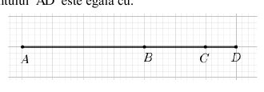
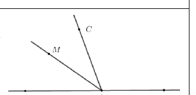
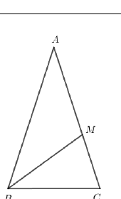
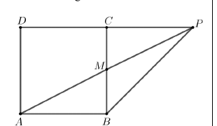
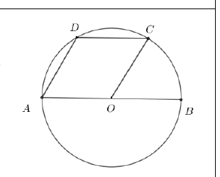
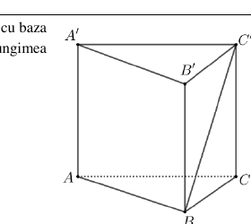
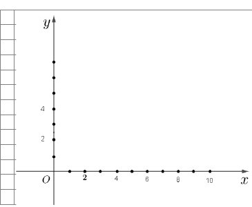
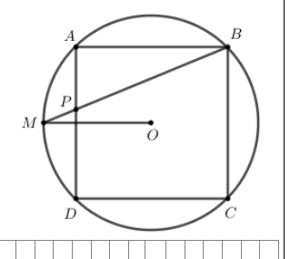
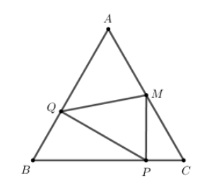
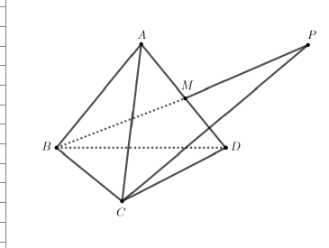

# Evaluarea Națională 2026 — Matematică

## Simulare — Subiect

**Anul școlar 2025–2026**

*Transcriere și formatare manuală după PDF-ul original. Figurile sunt păstrate separat în folderul de imagini al acestei variante.*

## SUBIECTUL I

**Încercuiește litera corespunzătoare răspunsului corect. (30 de puncte)**

### 1. (5p)

Rezultatul calculului $12-8:4$ este egal cu:

**a)** $16$  
**b)** $10$  
**c)** $5$  
**d)** $1$

### 2. (5p)

Din cei $26$ de elevi ai unei clase, $50\%$ sunt băieți. Numărul băieților din acea clasă este egal cu:

**a)** $5$  
**b)** $12$  
**c)** $13$  
**d)** $20$

### 3. (5p)

Cel mai mare număr natural din intervalul

$$
\left(\frac{2}{3},\frac{9}{4}\right]
$$

este egal cu:

**a)** $0$  
**b)** $1$  
**c)** $2$  
**d)** $9$

### 4. (5p)

Dacă

$$
2x=\frac{3}{2},
$$

atunci $4x$ este egal cu:

**a)** $\displaystyle\frac{3}{4}$  
**b)** $\displaystyle\frac{8}{3}$  
**c)** $3$  
**d)** $6$

### 5. (5p)

Patru elevi, Alin, Mihai, Ioana și Maria, au calculat produsul numerelor

$$
a=3+2\sqrt{2}
\qquad\text{și}\qquad
b=3-2\sqrt{2}.
$$

Rezultatele obținute de cei patru elevi sunt prezentate în tabelul de mai jos:

| Alin | Mihai | Ioana | Maria |
|:---:|:---:|:---:|:---:|
| 17 | 6 | 5 | 1 |

Conform informațiilor din tabel, rezultatul corect a fost obținut de:

**a)** Alin  
**b)** Mihai  
**c)** Ioana  
**d)** Maria

### 6. (5p)

Două pixuri și un caiet costă $20$ de lei. Enunțul „Patru pixuri și două caiete, de același tip, costă $40$ de lei” este:

**a)** adevărat  
**b)** fals

## SUBIECTUL al II-lea

**Încercuiește litera corespunzătoare răspunsului corect. (30 de puncte)**

### 1. (5p)

În figura alăturată, punctele $A$, $B$, $C$ și $D$ sunt coliniare, în această ordine, astfel încât lungimea segmentului $BC$ este jumătate din lungimea segmentului $AB$, iar lungimea segmentului $CD$ este jumătate din lungimea segmentului $BC$. Dacă $BC=4\text{ cm}$, atunci lungimea segmentului $AD$ este egală cu:

**a)** $20\text{ cm}$  
**b)** $14\text{ cm}$  
**c)** $12\text{ cm}$  
**d)** $7\text{ cm}$

### 2. (5p)

În figura alăturată sunt reprezentate unghiurile adiacente suplementare $\angle AOC$ și $\angle COB$. Semidreapta $OM$ este bisectoarea unghiului $AOC$, iar măsura unghiului $MOB$ este egală cu $145^\circ$. Măsura unghiului $BOC$ este egală cu:

**a)** $35^\circ$  
**b)** $70^\circ$  
**c)** $105^\circ$  
**d)** $110^\circ$

### 3. (5p)

În figura alăturată este reprezentat triunghiul isoscel $ABC$, cu $AB=AC$ și măsura unghiului $BAC$ egală cu $36^\circ$. Punctul $M$ aparține laturii $AC$, astfel încât $AM=BM$. Măsura unghiului $MBC$ este egală cu:

**a)** $18^\circ$  
**b)** $36^\circ$  
**c)** $54^\circ$  
**d)** $72^\circ$

### 4. (5p)

În figura alăturată este reprezentat pătratul $ABCD$, cu $AB=4\text{ cm}$. Punctul $M$ este mijlocul laturii $BC$. Dreptele $AM$ și $DC$ se intersectează în punctul $P$. Aria triunghiului $ABP$ este egală cu:

**a)** $3\text{ cm}^2$  
**b)** $4\text{ cm}^2$  
**c)** $8\text{ cm}^2$  
**d)** $16\text{ cm}^2$

### 5. (5p)

În figura alăturată este reprezentat cercul de centru $O$ și diametru $AB$. Punctele $C$ și $D$ aparțin cercului, astfel încât dreptele $AB$ și $CD$ sunt paralele, iar măsura unghiului $BOC$ este egală cu $60^\circ$. Măsura unghiului $BAD$ este egală cu:

**a)** $30^\circ$  
**b)** $60^\circ$  
**c)** $90^\circ$  
**d)** $120^\circ$

### 6. (5p)

În figura alăturată este reprezentată prisma dreaptă $ABCA'B'C'$, cu baza triunghiul echilateral $ABC$, cu $AA'=3\text{ cm}$ și $AB=4\text{ cm}$. Lungimea segmentului $BC'$ este egală cu:

**a)** $3\text{ cm}$  
**b)** $4\text{ cm}$  
**c)** $5\text{ cm}$  
**d)** $7\text{ cm}$

## SUBIECTUL al III-lea

**Scrie rezolvările complete. (30 de puncte)**

### 1. (5p)

Pentru a putea așeza elevii unei clase câte doi în fiecare bancă, în această sală de clasă, ar mai trebui adusă încă o bancă în care să fie așezați doi elevi.

**a) (2p)** Verifică dacă în această clasă pot fi $25$ de elevi. Justifică răspunsul dat.

**b) (3p)** Dacă elevii acestei clase se așază câte $4$ în bancă, atunci într-una dintre bănci stau doar $2$ elevi, iar $5$ bănci rămân libere. Determină numărul băncilor din această clasă.

### 2. (5p)

Se consideră expresia

$$
E(x)=
\left(
\frac{1}{x^2-3x+2}
 +
\frac{1}{1-x}
\right)
:\frac{x^2-6x+9}{x-1},
$$

unde $x$ este număr real,

$$
x\ne1,\qquad x\ne2,\qquad x\ne3.
$$

**a) (2p)** Arată că

$$
x^2-3x+2=(x-2)(x-1),
$$

pentru orice număr real $x$.

**b) (3p)** Arată că numărul

$$
T=E(4)+E(5)+E(6)+E(7)
$$

este mai mic decât

$$
-\frac{\sqrt{2}}{2}.
$$

### 3. (5p)

În sistemul de axe ortogonale $xOy$ se consideră punctele $A(2,0)$ și $B(10,4)$.

**a) (2p)** Arată că

$$
AB=4\sqrt{5}.
$$

**b) (3p)** Determină coordonatele punctului $M$, situat pe axa $Ox$, aflat la distanțe egale față de punctele $A$ și $B$.

### 4. (5p)

În figura alăturată este reprezentat cercul de centru $O$. Punctele $A,B,C,D$ aparțin cercului, astfel încât $ABCD$ este pătrat, cu $AB=4\text{ cm}$. Punctul $M$ este mijlocul arcului mic $AD$, iar dreptele $AD$ și $BM$ se intersectează în punctul $P$.

**a) (2p)** Arată că

$$
MO=2\sqrt{2}\text{ cm}.
$$

**b) (3p)** Demonstrează că tangenta unghiului $BPA$ este egală cu

$$
1+\sqrt{2}.
$$

### 5. (5p)

În figura alăturată este reprezentat triunghiul echilateral $ABC$, cu $AB=8\text{ cm}$. Punctul $M$ este mijlocul segmentului $AC$, punctul $P$ este proiecția punctului $M$ pe dreapta $BC$, iar punctul $Q$ este proiecția punctului $P$ pe dreapta $AB$.

**a) (2p)** Arată că

$$
PC=2\text{ cm}.
$$

**b) (3p)** Determină aria triunghiului $MPQ$.

### 6. (5p)

În figura alăturată este reprezentat tetraedrul regulat $ABCD$, cu $AB=6\text{ cm}$. Punctul $M$ este mijlocul muchiei $AD$, iar punctul $P$ este simetricul punctului $B$ față de punctul $M$.

**a) (2p)** Arată că

$$
CP=6\sqrt{2}\text{ cm}.
$$

**b) (3p)** Arată că sinusul unghiului dreptelor $DP$ și $CM$ este egal cu

$$
\frac{\sqrt{33}}{6}.
$$

